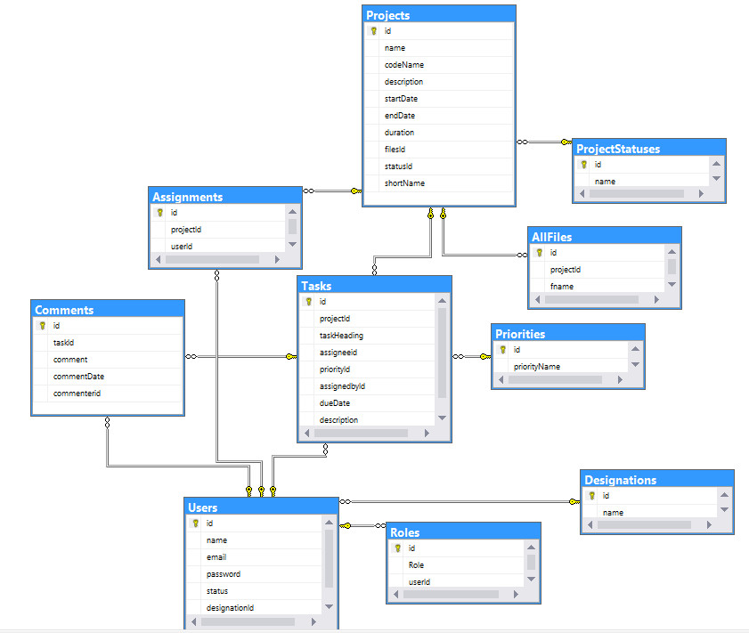
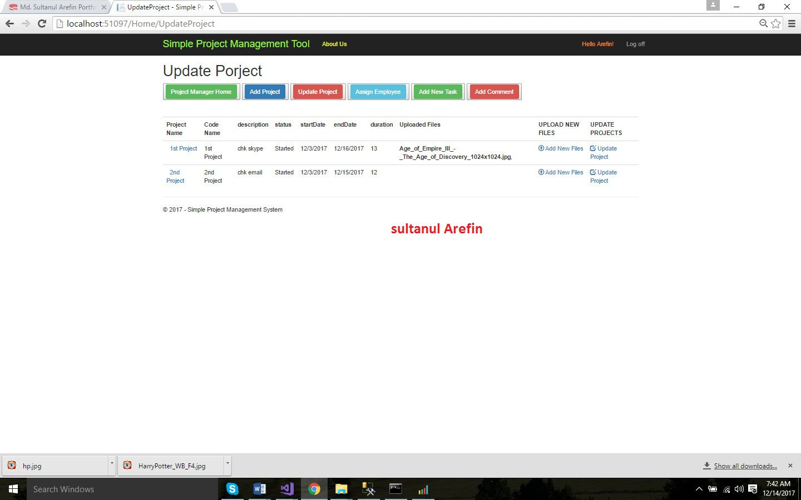

# Simple Project Management Tools

This is a tentative Asp.net MVC project. It has following Users/Employees. 

**It Admin:**
Responsible for creating Users/Employees. (e.g. Project Manager,Developer etc).
IT admin is Inserted into database as first Employee (similar to seed data from Code first approach).

**Project Manager:**
Created by It Admin, can add projects, update/delete projects, assign employees, can create task and add
comment to task, View Project in which he/she is involved. view Project Details, 
View Task Details,View Comment Details and a few more things.

**Team Lead,Developer,QA Engineer,UX Engineer:**
Created by It Admin, can create task and add comment to task,
View Project in which he/she is involved. view project details, view task details,View Comment Details
and a few more things.

**Only code files ** are added in this repo.

[Twitter](https://twitter.com/mdsultanul)

[LinkedIn](https://linkedin.com/in/mdarefin28/)

Thanks!

-Md. Sultanul Arefin
